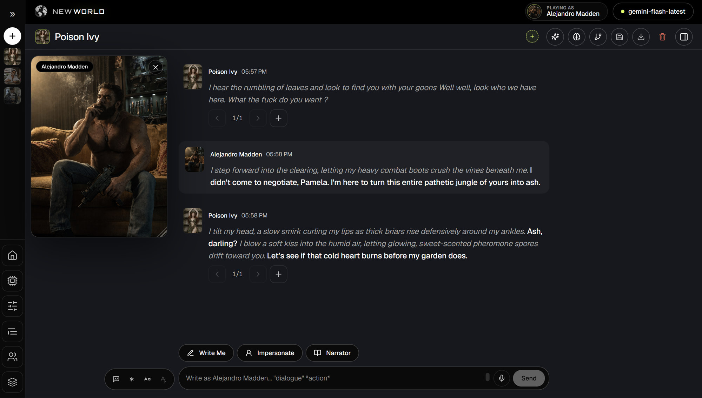

<p align="center">
  
</p>

<h1 align="center">Reverie</h1>

<p align="center">
  <strong>Local-first AI story studio</strong><br />
  Characters with <em>real minds</em> · Director-led ensembles · Stories that remember
</p>

<p align="center">
  
</p>

<p align="center">
  <a href="#-quick-start"></a>
  <a href="#-character-brain"></a>
  <a href="#-privacy"></a>
</p>

<p align="center">
  
  
  
  
  
</p>

---

**Reverie** is a modern AI story studio: a cinematic **Analogue Noir** UI, a full card/lore/preset engine, and a **Character Brain** grounded in cognitive science — memory, psyche, and theory of mind.

Bring your own models. Import cards & lore. Direct the cast. Keep every file on *your* disk.

> Inspired by [SillyTavern](https://github.com/SillyTavern/SillyTavern) — rebuilt from zero for long-form stories, group ensembles, and minds that change.

---

## ✨ Why people switch

| | Feature | What you get |
|:-:|---|---|
| 🧠 | **Character Brain** | Living memory + psyche + theory of mind — not a chat summary |
| 🎬 | **AI Director** | Picks who speaks next from *context* — cast, Narrator, or *you* |
| 🎭 | **Play as anyone** | Occupy a seat mid-scene; the AI never writes your character |
| ✍️ | **Write Me · Impersonate · Narrator** | Draft your line, take a character’s turn, or cut to the world |
| 📘 | **Skills** | Global craft docs (fights, reads, trades…) that characters can draw on |
| 👁 | **On-device vision** | Portraits described locally; images never leave the machine |
| 🌱 | **Genesis** | Scene needs a stranger? Full V3 card + style-matched avatar |
| 🌿 | **Timeline forks** | Branch mid-chat, deep-swipe history, restore without new chats |
| 🎨 | **Image Director** | Structured art prompts + group style profiles |
| 🔒 | **Local-first** | Plain files under `data/` — no account, no cloud lock-in. OpenRouter calls force ZDR / no data collection |

---

## 🧠 Character Brain

> Each character carries a **mind**, not a sticky note.

One brain per `(chat × character)`. Same card, different chat → different person. Delete the chat → those minds go with it. In groups, each member encodes **only what they witnessed**.

```
  event ──► APPRAISE ──► ENCODE ──► LINK ──► DECAY ──► RECALL
              │            │          │        │          │
           CPM emotion   episodes   edges   power-law   budgeted
           + traits      trauma     people  forgetting  prompt
                         schemas
```

| Layer | Behavior |
|---|---|
| **Episodic → semantic → schema** | Events compress into facts, then *beliefs* that bias later appraisal |
| **ACT-R + fuzzy-trace** | Hot memories surface first; gist survives after verbatim fades |
| **Mood-congruent recall** | Angry characters retrieve angry history first |
| **Trauma S-reps** | High-arousal sensory nodes can *intrude* unbidden |
| **Reconsolidation** | Prediction error rewrites memory and costs fidelity |
| **Theory of mind** | Who knows what — secrets stay secret until someone was actually there |
| **Mentation** | Idle introspection between turns; the mind does not freeze when you stop typing |
| **Relations + trait drift** | Trust / warmth / power per person; personality moves slowly, anchored to the card |
| **1/3 budget rule** | Brain never steals the whole context window |

**Psyche** sits on top: emotion → mood → tone → temperament, plus body load, coping, and attachment. Math where it matters; the model writes prose, it does not “decide it has PTSD.”

**Mind UI** (`/mind`) — nodes, edges, mood, relations, and what gets injected next turn. Off switch: delete `data/brains/`.

---

## 🎬 Groups & Director

| Mode | How turns work |
|---|---|
| **Director** ⭐ | Agent reads the scene → next speaker — cast / `USER` / `NARRATOR` |
| Natural · List · Pooled · Manual | Classic ST-compatible group modes |

- **Narrator** as a first-class voice (time, place, world events)
- **Play as…** — your seat is locked; the model will not write that character
- **Director console** — intensity, scene goals, cut-tos, tone
- **Genesis** — mint a V3 card + avatar in the table’s art style

---

## 💬 Story engine

| Area | Capabilities |
|---|---|
| **Cards** | V1 / V2 / V3 · PNG `chara`/`ccv3` · JSON · alt greetings · photo gallery |
| **Chat** | Stream · swipes · edit · regen · continue · Write Me · Impersonate · Narrator · branches |
| **Skills** | `/skills` library · auto / always / manual · keyword fire · token-capped slot |
| **World** | Lorebooks (keys, selective, sticky, budget, recursion) |
| **Prompt craft** | Visual **Preset Composer** · Instruct / Context / Sys / Reasoning packs |
| **Macros** | `{{char}}`, `{{user}}`, rolls, picks, vars |
| **Power tools** | Author’s note · regex · slash commands · **Inspector** · **Terminal** (live request log) |
| **Timeline** | Fork futures · checkpoints · deep-swipe · restore |

---

## 🎨 Images & studio

- Separate **Image API** from text (Google / OpenAI / OpenRouter / fal / Replicate / custom)
- **Image Director** → subject · action · setting · light · style
- **On-device vision** — a local VLM captions portraits so the picture itself never hits the cloud (strict mode = no silent fallback)
- **Style Analyst** → group `style_profile` so new faces match the table
- No key? Copyable prompt card + drop zone
- **Character Creator** · portrait crop · drag-drop import

---

## 🔌 Connections

**Text:** OpenAI · Anthropic · Google · OpenRouter · any OpenAI-compatible proxy  
**Image:** Nano Banana / Gemini image · GPT Image · Seedream · FLUX · more  
Utility / cheap models for background work (memory, director, proofread) so the main model stays on the reply.

Keys stay in local `secrets`. OpenRouter traffic is forced through **ZDR** (`data_collection: deny`) — nothing is routed to an endpoint that retains prompts.

---

## 🖥️ UX that stays in the chat

Drawers, not page hops: **API · Presets · Format · Library · Lore · Skills · Memory · Security · Terminal**.

```
┌─────────┬──────────────────────────────┬──────────┐
│ Chats   │  drawers · never leave chat  │ Director │
│ shelf   │  Write Me · Impersonate      │ Timeline │
│ World   │  Narrator · portrait float   │ Inspector│
└─────────┴──────────────────────────────┴──────────┘
```

Portrait float · soft reveal · optional local STT · Windows **`Start.bat`**.

---

## ⚡ Quick start

**Need:** Node.js **20+** · a text model API key

### Windows
Double-click **`Start.bat`** → [http://localhost:5173](http://localhost:5173)

### Any OS

```bash
npm install
npm run dev          # API :6969 · UI :5173
```

1. **API** drawer → provider + key  
2. Drop a character card (`.png` / `.json`) on the shelf  
3. Chat — turn on **Brain** when you want minds that grow  

```bash
npm run build && npm start    # UI + API on :6969
```

| Script | |
|---|---|
| `npm run dev` | Server + Vite |
| `npm run build` | Typecheck + client |
| `npm start` | Express serves `dist/` |
| `npm test` | Engine + brain tests |

---

## 🏗️ Layout

```
Reverie/
├── src/              # React UI — shell, chat, mind, skills, creator
├── server/           # Express — generate, library, brain, skills, vault
│   └── defaults/     # Shipped seeds (starter card, packs, sample skills)
├── shared/           # Engine shared by client & server
│   ├── brain/        # Memory graph, activation, consolidation
│   ├── psyche/       # Affect, body, theory of mind
│   ├── skills/       # Craft docs → prompt slot
│   ├── engine/       # Prompt builder, lore, macros, timeline
│   └── codec/        # Card / lorebook / preset / PNG
├── public/           # Brand + README assets
└── data/             # YOUR runtime (gitignored — never published)
```

First run copies `server/defaults/` → empty `data/` folders. After that, the app only touches **`data/`**.

---

## 🔒 Privacy

| How it got there | Where | GitHub? |
|---|---|:---:|
| Your imports, chats, keys, brains, skills, settings | `data/` | ❌ never |
| Starter card, default packs, example skills | `server/defaults/` | ✅ package |
| App source | `src/` `server/` `shared/` | ✅ |

**Rule:** if you did it in the UI, it stays private. Vault-sealable storage. OpenRouter: ZDR only. Portraits: on-device vision by default. Contributor map: **`AGENTS.md`**.

---

## 📜 License

See the repo for license terms. Model APIs are yours — BYOK, their policies apply.

---

<p align="center">
  <strong>Build worlds. Direct the cast. Let them remember.</strong><br />
  <sub>Reverie · local minds, cinematic stories</sub>
</p>
